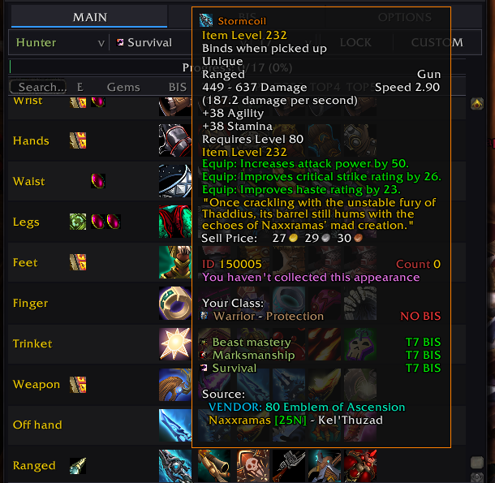

<div align="center">

# BiSTooltip — Whitemane Frostmourne

**A Core data overlay for Frostmourne custom currencies, vendor offers, and legendary rankings.**


</div>

This addon extends BiSTooltip Core for the Whitemane **Frostmourne** realm. Core is a hard dependency: the plugin has no independent window, settings, SavedVariables, or slash commands.

This overlay is **not** a selectable ranking database. Continue to choose **WoWSimsBP (STANDARD)** or **wowtbc.gg** in Core; the plugin replays its compatible server changes over whichever database is active.

## Quick Start

1. Install BiSTooltip Core 3.0.0 from the `main` branch or `core-v3.0.0` release.
2. Download this plugin from `Bistooltip_Whitemane_Frostmourne` or the `whitemane-frostmourne-v1.0.1` release.
3. Place both addon folders directly under `World of Warcraft/Interface/AddOns/`.
4. Enable **Bis-Tooltip** and **Bistooltip — Whitemane: Frostmourne** at character selection.
5. Confirm that chat shows `Whitemane Frostmourne loaded`, then enter `/bis` and use Core normally.

The required folder layout is:

```text
Interface/AddOns/
├── Bistooltip/
│   └── Bistooltip.toc
└── Bistooltip_Whitemane_Frostmourne/
    └── Bistooltip_Whitemane_Frostmourne.toc
```

Do not place the plugin inside the Core folder. Enable only the server overlay that matches the realm you play.

## What the Overlay Adds

- **Custom-currency offers:** reviewed Echo of the Titans routes are active. Emblem of Ascension vendor data is retained but disabled until the Phase 2 vendor rescan.
- **Reviewed Justice and Valor prices:** vendor offers replace obsolete vendor prices while keeping non-vendor drops, tokens, marks, and activities.
- **Legendary rank insertions:** selected Frostmourne legendary weapons move to rank 1 for supported class/spec/phase targets without duplicating the item.
- **Known activity sources:** confirmed quest/drop methods are added as activity descriptions when an exact merchant cost or encounter is not part of the data.
- **Database-switch replay:** Core records and reapplies plugin changes after switching ranking databases, without multiplying identical acquisitions.

Legendary insertions include server items such as Embersoul (`128858`), Atiesh (`130023`), Armata Strigoi (`130031`), Doomhammer (`131004`), and Stormcoil (`150005`). Existing ranked alternatives shift down within the slot's capacity.

The overlay adds data only. Core owns tooltips, MAIN/BIS/VENDOR views, filtering, export, cache handling, personal priorities, and database selection.

## Verification

<p align="center">
  
</p>

After installing both current packages:

1. Open Core with `/bis` and select **WoWSimsBP (STANDARD)**.
2. Check item `45286` with `/bisemblem 45286` or its Core tooltip. It should include an **Echo of the Titans** vendor cost.
3. Select Mage → Arcane → T7 and inspect the Weapon slot. Atiesh item `130023` should be the leading legendary ranking.
4. Switch the bottom-bar database selector to **wowtbc.gg**, wait for the view to rebuild, then switch back to **WoWSimsBP (STANDARD)**.
5. Recheck the currency route and representative ranking. The acquisition must not duplicate, and the legendary insertion must return when its class/spec/phase target exists. Emblem of Ascension routes remain hidden until they are rescanned for Phase 2.

Some profiles or phases are not present in both bundled databases. Core safely defers a valid overlay target that the active database cannot display; that does not turn the plugin into a third database.

## Troubleshooting

- **Dependency missing or disabled:** confirm that `Bistooltip/Bistooltip.toc` exists and Core is enabled. The plugin loads after Core.
- **No custom prices appear:** verify that this exact plugin is enabled and that a different server overlay is not being used by mistake.
- **A legendary does not appear:** select a class/spec/phase that owns one of the overlay's targets and use the current Core package, which provides `InsertBiSSlotRank`.
- **Rows duplicate after a switch:** run `/bis repairrows` and `/bis reload`, then confirm that only one copy of the plugin is installed.
- **An item name or icon is unavailable:** let the WoW client cache the item, then press **RELOAD** in Core.

## Component Identity

| Component | Branch | Release tag | Addon folder |
| --- | --- | --- | --- |
| Required Core | `main` | `core-v3.0.0` | `Bistooltip` |
| This plugin | `Bistooltip_Whitemane_Frostmourne` | `whitemane-frostmourne-v1.0.1` | `Bistooltip_Whitemane_Frostmourne` |

The Scanner and WOTLK5 S2 packages are separate components and are not required by this plugin.

## Credits

BiSTooltip maintenance and Frostmourne data integration: Divian. Original Core addon and backport credits remain in the Core package.
