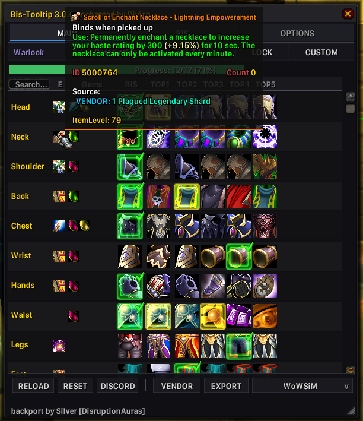

<div align="center">

# BiSTooltip — WOTLK5 S2

**A Core overlay for WOTLK5 Season 2 vendor data and profession-aware recommendations.**


</div>

This addon extends BiSTooltip Core for the **WOTLK5 Season 2** server. Core is a hard dependency: the plugin has no independent window, settings, SavedVariables, or slash commands.

This overlay is **not** a selectable ranking database. Continue to use **WoWSimsBP (STANDARD)** or **wowtbc.gg** in Core; the WOTLK5 data is replayed over the active database.

## Quick Start

1. Install BiSTooltip Core 3.0.0 from the `main` branch or `core-v3.0.0` release.
2. Download this plugin from `Bistooltip_WOTLK5_S2` or the `wotlk5-s2-v1.0.1` release.
3. Place both addon folders directly under `World of Warcraft/Interface/AddOns/`.
4. Enable **Bis-Tooltip** and **Bistooltip WOTLK5 S2** at character selection.
5. Confirm that chat shows `WOTLK5_S2 loaded`, then enter `/bis` and use Core normally.

The required folder layout is:

```text
Interface/AddOns/
├── Bistooltip/
│   └── Bistooltip.toc
└── Bistooltip_WOTLK5_S2/
    └── Bistooltip_WOTLK5_S2.toc
```

Do not place the plugin inside Core. Enable only the server overlay that matches the realm and season you play.

## What the Overlay Adds

- **Vendor data:** 620 additional purchase routes priced primarily in Emblem of Plague and Emblem of Resolve while retaining Core's existing routes.
- **Custom scroll acquisitions:** nine WOTLK5 scrolls priced at one Plagued Legendary Shard.
- **Enchanting recommendations:** profession skill line `333` supplies COMMON Trinket and Finger enhancements for all supported phases.
- **Inscription recommendations:** profession skill line `773` supplies COMMON Head and Shoulder enhancements for all supported phases.
- **T7 legendary Neck recommendations:** one role-appropriate Neck scroll is selected only in T7; Warlock Affliction uses the critical-rating variant.
- **Safe enhancement layering:** a plugin rule replaces only the first enhancement entry and preserves every later gem from the active ranking database.
- **Database-switch replay:** Core reapplies vendor and enhancement data after either active ranking database is selected.

The recommendation matrix covers 32 tank, physical DPS, spell DPS, and healer profiles, producing 160 targeted rules. Profession rules apply only when the current character owns the required profession and when viewing that character's class. The T7 Neck rule is global for its supported profile and does not require a profession.

## Recommendation Scope

| Slot | Requirement | Phase | Examples |
| --- | --- | --- | --- |
| Trinket | Enchanting (`333`) | All phases | tank `5000162`, physical DPS `5000161`, spell/healer `5000160` |
| Finger | Enchanting (`333`) | All phases | tank `59636`, physical DPS `44645`, spell/healer `44636` |
| Head | Inscription (`773`) | All phases | role-specific spell IDs `5000156`–`5000159` |
| Shoulder | Inscription (`773`) | All phases | role-specific spell IDs `61117`–`61120` |
| Neck | No profession | T7 only | tank `5000766`, most DPS/healers `5000764`, Affliction `5000765` |

The custom Trinket and Head values are spell/enchant IDs. Neck values are scroll item IDs with recorded Plagued Legendary Shard acquisition costs.

## Verification

<p align="center">
  
</p>

After installing both current packages:

1. Open Core with `/bis` and choose **WoWSimsBP (STANDARD)**.
2. Verify a vendor route with `/bisemblem 39146`. It should include an **Emblem of Plague** cost.
3. On an Enchanting character, open a supported profile for that character's class. For Warrior → Protection, the Trinket recommendation should use spell `5000162` and Finger should use `59636`.
4. In T7, inspect the same tank profile's Neck recommendation. It should use scroll item `5000766`.
5. Switch to a later phase such as T8. The T7 Neck override must disappear, while the database's later gem entries remain after any applicable profession recommendation.
6. Switch the bottom-bar database selector to **wowtbc.gg**, let the view rebuild, then return to **WoWSimsBP (STANDARD)**. Recheck the vendor route and recommendations for a profile available in the selected database.

The overlay should replay without duplicate vendor lines. A class/spec/phase absent from a database is safely unavailable there; the plugin does not become another ranking source.

## Troubleshooting

- **Dependency missing or disabled:** confirm that `Bistooltip/Bistooltip.toc` exists and Core is enabled.
- **Profession recommendations do not appear:** test on the character's own class and confirm that Enchanting or Inscription is learned and visible to the 3.3.5a skill APIs.
- **The Neck appears outside T7:** run `/bis repairrows` and `/bis reload`, then confirm only one current plugin copy is installed.
- **A later gem disappeared:** verify the exact profile and database, reload Core, and capture the slot before changing priorities.
- **A vendor cost is absent:** ensure the WOTLK5 S2 overlay is enabled and query the item with Core's `/bisemblem <itemID>` command.
- **An item or icon is unavailable:** let the WoW client cache it, then press **RELOAD** in Core.

## Component Identity

| Component | Branch | Release tag | Addon folder |
| --- | --- | --- | --- |
| Required Core | `main` | `core-v3.0.0` | `Bistooltip` |
| This plugin | `Bistooltip_WOTLK5_S2` | `wotlk5-s2-v1.0.1` | `Bistooltip_WOTLK5_S2` |

The Scanner and Whitemane Frostmourne packages are separate components and are not required by this plugin.

## Credits

BiSTooltip maintenance and WOTLK5 Season 2 data integration: Divian. Original Core addon and backport credits remain in the Core package.
