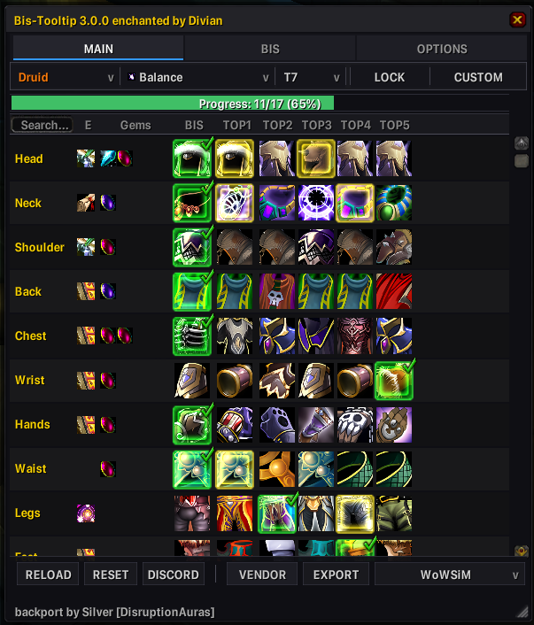
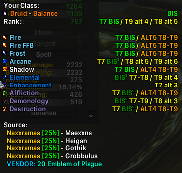
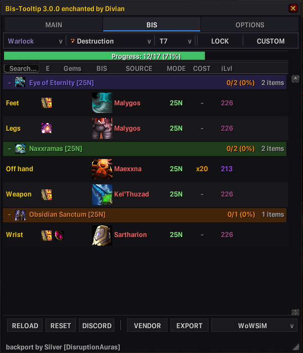
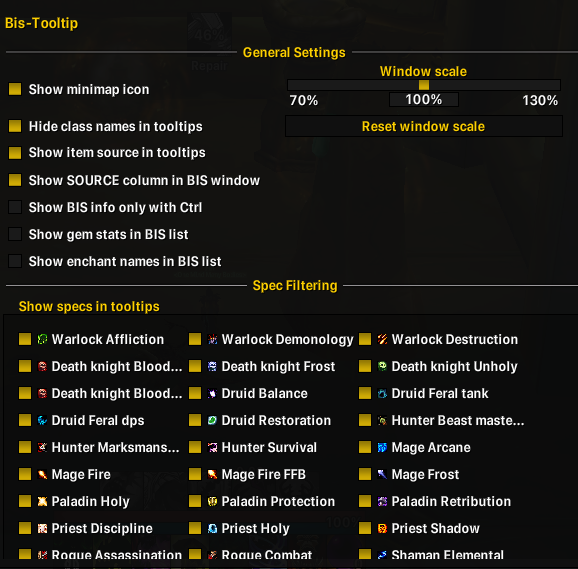
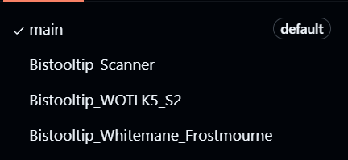

# BiSTooltip Core

**Best-in-Slot rankings, acquisition details, and a practical gear checklist for World of Warcraft 3.3.5a.**

BiSTooltip Core is a universal addon for standard World of Warcraft: Wrath of the Lich King 3.3.5a. It intentionally contains no private-server custom items, currencies, vendors, or rules; server-specific data belongs in optional plugins. Core 3.0.0 adds ranked gear information and acquisition sources to item tooltips, then brings the same data into a browsable checklist window with two ranking databases, faction-aware data, ownership tracking, vendor views, and personal priorities.

  

<table>
  <tr>
    <td align="center" width="50%">
      
    </td>
    <td align="center" width="50%">
      
    </td>
  </tr>
  <tr>
    <td align="center">Ranked tooltip details</td>
    <td align="center">Vendor purchase routes</td>
  </tr>
  <tr>
    <td align="center" colspan="2">
      
       Interface settings
    </td>
  </tr>
</table>

## Quick Start

1. Download the Core package from the `main` branch or the `core-v3.0.0` release.
2. Copy the `Bistooltip` folder into `World of Warcraft/Interface/AddOns/`.
3. Confirm that the manifest is at `Interface/AddOns/Bistooltip/Bistooltip.toc`.
4. Enable **Bis-Tooltip** at character selection and log in or reload the UI.
5. Enter `/bis` to open the main window.
6. Choose a class, specialization, and phase. Use the database selector after **EXPORT** in the bottom action bar when you want to change ranking sources.

All required libraries are included. DataStore and DataStore_Inventory are optional.

## What Core Provides

- Ranked item tooltips with configurable class/spec visibility and highlighting.
- Canonical acquisition lines for drops, tokens, marks, vendors, activities, and custom sources.
- Native token and Trophy of the Crusade icons when their item data is cached.
- Faction-aware rankings and acquisition data.
- Character ownership indicators based on the current character's equipped items and bags.
- Optional gem and enchant details in the checklist.
- Safe, replayable server-plugin overlays across database changes.

## Main Window

The main window keeps class, specialization, and phase controls together with four focused workflows:

| Control | Purpose |
| --- | --- |
| **MAIN** | Browse up to six ranked alternatives per equipment slot. |
| **BIS** | Turn the ranking into an acquisition checklist grouped by source location. |
| **VENDOR** | While on the BIS tab, show only ranked items with a recorded purchase route and display each available offer. |
| **CUSTOM** | While on MAIN, unlock a slot and choose two item icons to reorder its personal priorities. |
| **LOCK** | Hold the selected phase while changing other filters. |
| **RESET** | Restore the active database/plugin order for the current selection. |
| **EXPORT** | Open a copyable text version of the current BIS checklist. |
| **RELOAD** | Rescan owned items, clear display caches, request missing item data, and rebuild the view. |
| **Scale grip** | Drag the lower-right grip with the left mouse button to scale the window; right-click it to reset to 100%. |

Shift-click an available item to link it in chat. Ctrl-click previews equipment when the game can provide an item link.

Personal item priorities, the selected ranking database, and window scale are account-wide. Priorities are reconciled by item ID after a database change. Character, specialization, and phase are preserved by name when the destination database contains them; otherwise the window uses a safe available profile.

## Ranking Databases

Core exposes exactly two ranking choices:

| Database | Key | Notes |
| --- | --- | --- |
| **WoWSimsBP (STANDARD)** | `wowsims` | Default snapshot with faction-specific overrides. |
| **wowtbc.gg** | `wowtbc` | Alternative bundled ranking snapshot. |

Use the compact selector immediately after **EXPORT** in the bottom action bar. Its menu opens upward so it stays within the window area. Changing the database refreshes the controls and table, resets database-specific caches, and replays installed server overlays. Re-selecting the active database is a no-op.

The snapshots are bundled with the addon; switching databases does not download current web data.

## Ownership and Item Cache

Core scans the current character's equipped items and bags. DataStore modules are optional dependencies, but the built-in checklist count does not promise bank or alternate-character inventory; verify storage that is not available to the current client session.

World of Warcraft resolves item names, links, and textures asynchronously. Core requests missing information in bounded batches, retries unresolved items, shows pending/unavailable progress, and ignores late results from an older selection. If the client has just learned many new items, press **RELOAD** after its local cache fills.

Ownership markers are guidance, not a replacement for checking storage that is unavailable to the current client session.

## Settings

Open settings with `/bis config` or the **OPTIONS** tab. Available controls include:

- minimap icon visibility;
- class-name separators in tooltips;
- item-source lines in tooltips;
- the independent **SOURCE** column in the BIS window;
- Ctrl-only tooltip details;
- detailed gem stats and enchant names;
- account-wide window scale from 70% to 130% in 5% steps, plus a reset button;
- visible specializations and one highlighted specialization;
- standard AceDB profile controls.

Database selection belongs to the main window action bar, not Interface Options. Window scale can be changed either in Interface Options or with the lower-right grip.

<strong>Commands</strong>

| Command | Action |
| --- | --- |
| `/bis` or `/bistooltip` | Open or toggle the main window. |
| `/bis config` | Open settings. |
| `/bis reload` | Rescan ownership, clear caches, and rebuild the active view. |
| `/bistooltip help` | Print command help. |
| `/bisemblem <item ID or item link>` | Print every recorded vendor purchase option for an item. |
| `/bis debug` | Run row-integrity diagnostics and print the current debug state. |
| `/bis debug on` / `/bis debug off` | Enable or disable detailed row snapshots. |
| `/bis repairrows` | Rebind the active database and replay overlays. |

## Optional Server Plugins

Server plugins extend Core; they are not ranking databases and do not provide separate windows or commands. Whitemane Frostmourne and WOTLK5 S2 are optional private-server plugins, while Core remains a clean, classic WotLK addon. Install a plugin folder beside `Bistooltip`, never inside it.

| Component | Branch | Release tag | Addon folder | Required dependency |
| --- | --- | --- | --- | --- |
| Core | `main` | `core-v3.0.0` | `Bistooltip` | — |
| Scanner | `Bistooltip_Scanner` | `scanner-v0.2.1` | `Bistooltip_Scanner` | Optional Core integration |
| Whitemane Frostmourne | `Bistooltip_Whitemane_Frostmourne` | `whitemane-frostmourne-v1.0.1` | `Bistooltip_Whitemane_Frostmourne` | Core |
| WOTLK5 S2 | `Bistooltip_WOTLK5_S2` | `wotlk5-s2-v1.0.1` | `Bistooltip_WOTLK5_S2` | Core |

  
   Choose the branch that matches the component you want to install.

Use the Whitemane plugin for Frostmourne custom currencies, vendor sources, and legendary ranking insertions. Use the WOTLK5 S2 plugin for its server vendor overlay and profession-aware equipment recommendations. Install only the overlay that matches your server.

The Scanner is a separate data-collection and export tool. It was designed to reduce the manual work required to review merchant data and implement additional plugins for other private servers; it does not change Core data by itself.

## Troubleshooting

- **The addon does not appear:** verify the exact folder nesting and enable **Load out of date AddOns** if your client requires it.
- **Names or icons show as unavailable:** hover the item, visit the relevant vendor, or press **RELOAD** after the client cache has populated.
- **The list shows the wrong profile after switching databases:** choose the desired class/spec/phase again; unavailable profiles intentionally fall back to a valid selection.
- **Rows appear duplicated or stale:** run `/bis repairrows`, then `/bis reload`.
- **Bank or alt ownership is missing:** this is expected from the built-in scan; its authoritative count covers the current character's equipped items and bags.
- **A server item or currency is missing:** confirm that the matching server plugin is installed, enabled, and loaded after Core.

## Credits

Original addon and backport work: Silver [DisruptionAuras], [disruption01](https://github.com/disruption01/BiS-Tooltip_335a_backport), and [ExoJdi](https://github.com/ExoJdi/BiS-Tooltip_335a_fixed_backport). The WoWSimsBP snapshot retains its upstream backport lineage. Refactoring and maintenance: Divian.

## License

BiSTooltip Core is distributed under the [MIT License](Bistooltip/LICENSE). Bundled third-party libraries retain their own notices and licenses.
