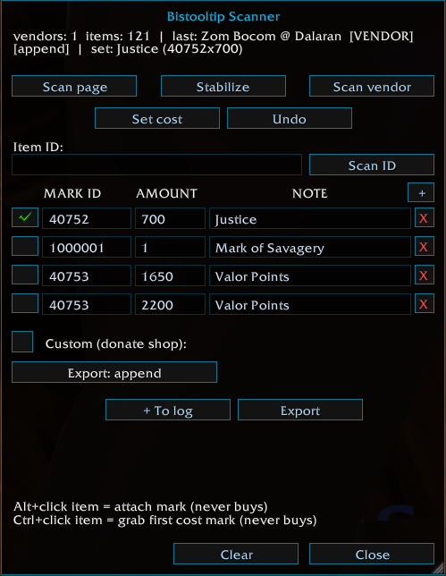
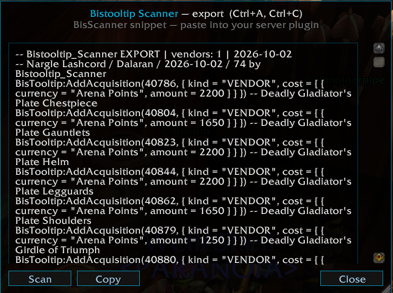

# BiSTooltip Scanner

**Capture WoW 3.3.5a merchant offers and export review-ready Core plugin data.**

Scanner is a standalone observation tool. It records merchant offers and manual item IDs in `BistooltipScannerDB`, then produces Lua or semicolon-separated CSV for review. It never changes Core rankings, installs a server overlay, or executes its generated Lua by itself.

## Quick Start

1. Download the `Bistooltip_Scanner` branch or the `scanner-v0.2.1` release.
2. Copy `Bistooltip_Scanner` into `World of Warcraft/Interface/AddOns/`.
3. Confirm the manifest is at `Interface/AddOns/Bistooltip_Scanner/Bistooltip_Scanner.toc`.
4. Enable **Bistooltip Scanner**, log in, and open a merchant.
5. Click **Scan BIS** or enter `/bisscan`.

Core is optional for collection. Install Core separately only when you also want to inspect or integrate reviewed output.

## Nine-Step Capture Workflow

1. **Open the merchant.** Let the visible page populate before collecting.
2. **Start the record.** Click **Scan BIS** or run `/bisscan`. A full scan replaces the previous record for the same `Vendor @ Zone` key.
3. **Collect every page.** Visit each merchant page and use `/bisscan page` to merge it, or run `/bisscan stab` to rescan until two stable passes or the eight-pass limit. Closing the merchant stops stabilization.
4. **Resolve the item cache.** Hover missing items, wait for names and currency links, then rescan the page or stabilize again. Positional placeholders are replaced when the server supplies the real item.
5. **Apply mark presets when needed.** Open `/bisscan menu`, Ctrl-left-click a merchant item to capture the first item-currency ID from its cost as the active mark, set the required amount, then Alt-left-click the item you want to save. Both modified clicks are captured and never purchase; Ctrl takes priority if both modifiers are held. Manual `/bisscan <itemID>` capture can reuse the active mark.
6. **Build a multi-vendor log.** Use **+ To log** in the menu for every vendor you want in one handoff. Re-adding the same merchant key updates it instead of creating a duplicate.
7. **Choose the export policy.** Select `append`, `replace_vendor`, or `replace_all` in the menu or with `/bisscan mode ...`. The selected mode is applied when Export is pressed.
8. **Export Lua or CSV.** Press **Export**, run `/bisscan export`, or run `/bisscan csv`. Copy the visible text; if it exceeds the display cap, retrieve the complete text from SavedVariables after logout or `/reload`.
9. **Resolve warnings and hand off for review.** Fix every `UNCACHED` and `EMPTY-COST` entry, review item and currency IDs, then place only approved calls into the correct server plugin. Scanner does not apply the output.

  

## Export Modes

The mode is one policy for the entire generated Lua export, not a property saved on each observation.

| Mode | Meaning | Generated API |
| --- | --- | --- |
| `append` | Adds another offer and keeps all existing acquisition routes. Identical entries are deduplicated by Core. | `BisTooltip:AddAcquisition` |
| `replace_vendor` | Replaces vendor offers while retaining non-vendor routes such as drops, tokens, marks, and activities. | `BisTooltip:ReplaceVendorAcquisitions` |
| `replace_all` | Replaces every acquisition route and is destructive. Use only for a reviewed full correction. | `BisTooltip:SetAcquisition` |

The selected mode is applied when **Export** is pressed. Changing it after a scan does not alter observations, and changing it after copying output does not rewrite that earlier text; export again.

In `append` mode, the combined log keeps separate offers for the same item from multiple merchants. Replacement modes keep the last logged merchant for a repeated item ID and warn about duplicates; export alternatives separately or curate a combined replacement.

The separate CUSTOM toggle writes a labeled `SetAcquisition` replacement without vendor costs. Treat it as a full replacement regardless of the selected VENDOR mode.

  

## Commands

`/bisscanner` is an alias for `/bisscan`.

| Command | Action |
| --- | --- |
| `/bisscan` | Scan the open merchant and replace its previous record. |
| `/bisscan page` | Merge the current merchant page into its record. |
| `/bisscan stab` | Merge repeated scans until stable or the eight-pass limit. |
| `/bisscan <itemID>` | Record an item by ID without discovering a source or price. |
| `/bisscan menu` | Open mark presets, export controls, and the vendor log. |
| `/bisscan setcost <markID> <amount>` | Fill empty prices in the latest record. |
| `/bisscan setcost <itemID> <markID> <amount>` | Replace one item's cost list in the latest record. |
| `/bisscan undo` | Undo the most recent manual cost assignment. |
| `/bisscan custom` | Toggle CUSTOM label export instead of VENDOR costs. |
| `/bisscan mode append` | Select additive offer export. |
| `/bisscan mode replace_vendor` | Select vendor-only replacement. |
| `/bisscan mode replace_all` | Select destructive full-route replacement. |
| `/bisscan export` or `/bisscan log` | Export the selected vendor log, or the latest record when the log is empty. |
| `/bisscan csv` | Export semicolon-separated item and cost rows. |
| `/bisscan clearlog` | Clear the selected-vendor log while retaining observations. |
| `/bisscan clearcache` | Ask for confirmation, then delete collected scanner data. |

## Mark Presets and Manual IDs

The menu supports up to six mark presets. Editing the active preset's ID or amount immediately changes the pending cost used by later captures. Editing an inactive preset does not. Clearing, deselecting, or deleting the active preset clears the pending mark.

Manual ID capture depends entirely on `GetItemInfo`. It records no merchant identity, source, money price, stock, or server-side cost that the client did not provide. There is no promised background completion: after the cache resolves, export can refresh names, but you must verify and supply the intended acquisition details.

## Window Size and Scale

Drag the bottom-right grip normally to resize a Scanner window. In the menu, the MARK ID, AMOUNT, and NOTE columns widen together with the window. Hold **Shift** while dragging the same grip to scale the Scanner UI instead; the scale is shared by the menu and export window and saved account-wide. Right-click the grip to reset the scale to 100%.

## SavedVariables and Copy Limit

Scanner uses the account-wide `BistooltipScannerDB` table. Merchant records use `Vendor @ Zone` keys, so identical vendor and zone names on different realms share that key.

The export window displays at most **500 lines**. Complete Lua output remains in `BistooltipScannerDB._logText` and complete CSV output in `BistooltipScannerDB._csvText`. World of Warcraft writes SavedVariables on logout or `/reload`. A truncated copy-window view is not the complete export.

`/bisscan clearcache` is destructive and requires confirmation in the game UI. It removes merchant/manual observations, log text, CSV text, history, undo state, and active collected marks while retaining configured mark preset definitions, the CUSTOM preference, and the window scale.

## Warnings and Data Limits

- `UNCACHED` means an item or currency name was unavailable. Hover it, wait for the client cache, and rescan or export again.
- `EMPTY-COST` means no usable money or currency cost was captured. The comment retains the raw `nCost` diagnostic; use `setcost` only after verifying the real price.
- Stock WoW 3.3.5a Honor Points, Arena Points, token items, and money can coexist in one captured price. Money is stored in copper.
- A defensive eight-row cap limits malformed token-row counts without truncating Honor or Arena amounts.
- Currency rows with neither an item ID nor a name are omitted from Lua and CSV output.
- CSV columns are `itemID;name;currency;amount;currID;money`. Each cost uses one row; no-cost records keep cost fields empty.

## Troubleshooting

- **No merchant data:** keep the merchant window open and use `/bisscan` again.
- **A page is incomplete:** visit that page and merge it, or use stabilization.
- **A name stays uncached:** hover the item/currency, wait, rescan, then export again.
- **The wrong mark was attached:** correct the active preset before capture or use `setcost`; `undo` provides one level for manual assignments.
- **The copy window ends early:** use the complete SavedVariables field after `/reload` or logout.
- **An export would remove valid routes:** stop and select `append` or `replace_vendor`; `replace_all` is intentionally destructive.

## Related Components

| Component | Branch | Release tag | Relationship |
| --- | --- | --- | --- |
| Core | `main` | `core-v3.0.0` | Optional during scanning; required to use reviewed plugin calls. |
| Scanner | `Bistooltip_Scanner` | `scanner-v0.2.1` | This addon. |
| Whitemane Frostmourne | `Bistooltip_Whitemane_Frostmourne` | `whitemane-frostmourne-v1.0.1` | Possible reviewed-output destination for that server. |
| WOTLK5 S2 | `Bistooltip_WOTLK5_S2` | `wotlk5-s2-v1.0.1` | Possible reviewed-output destination for that server. |
